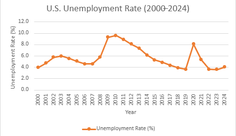

# US Labor Market Analysis

## Objective
This project analyzes trends in the United States labor market using data from the Bureau of Labor Statistics (BLS). The goal is to identify patterns in unemployment, wage growth, and employment trends over time.

## Dataset
Data source: U.S. Bureau of Labor Statistics (BLS)

Key variables analyzed:
- Unemployment rate
- Wage growth
- Employment levels

## Analysis Methods
The analysis includes:
- Data cleaning in Excel
- Trend analysis
- Visualization using charts

## Key Insights
• U.S. unemployment rose sharply during the Great Recession, peaking around 2009–2010.

• The labor market experienced steady recovery throughout the 2010s, with unemployment falling to historically low levels by 2019.

• The COVID-19 pandemic caused a dramatic spike in unemployment in 2020, followed by a rapid recovery in subsequent years.

## Conclusion
(To be filled after completing the analysis)

## Labor Market Trend Visualization

